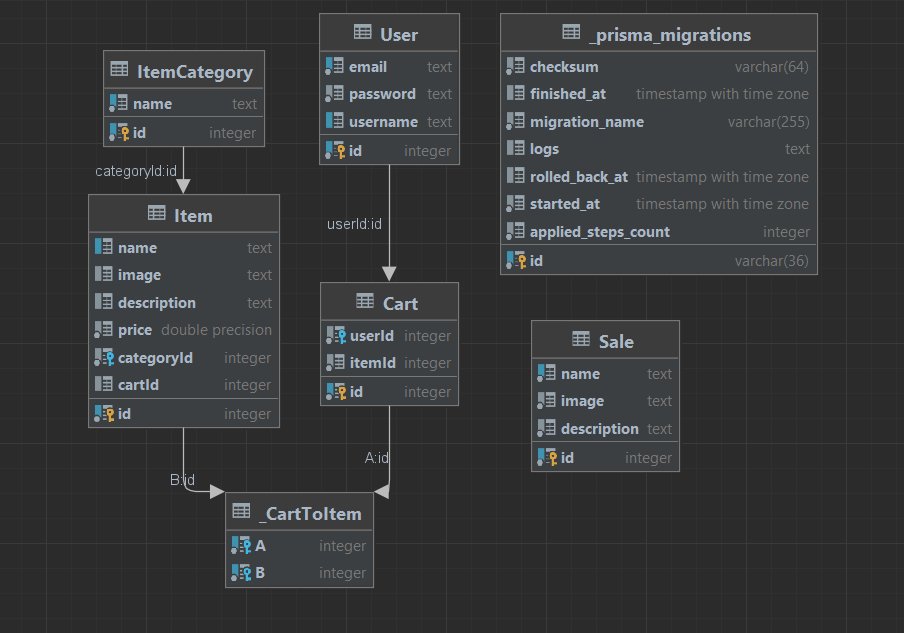

## Автор
___
Смирнов Георгий Александрович, группа M33031

## Описание
___

Посмотреть приложение на хостинге heroku можно по ссылке: <a href="https://gogo-pizza.herokuapp.com/" target="blank">Gogo Pizza</a>

## ERD
___

* ### User

  Пользователь - основная сущность в системе.

    * **id** - уникальный идентификатор пользователя в системе. Генерируется автоматически
    * **email** - обязательное текстовое поле.Значение должно быть уникальным в системе.
    * **password** - обязательное текстовое поле. Значение должно быть униккально.
    * **username** - необязательное текстовое поле. Можно заменить в любой момент, уникальность не требуется

  Также, у каждого пользователя есть связанная с ним корзина,в которой могут хранится элементы Item. 
    * **Cart** - собирается из таблицы Cart.
  
* ### Item

  Сущность, которая может быть одной из категорий. Необходима для создания для таких элементов как пицца,напитки и т.д.

    * **id** - уникальный идентификатор поста в системе. Генерируется автоматически
    * **name** - Уникальное текстовое поле, может быть пустым. Должно быть уникально.
    * **image** - Текстовое поле заполняется по желанию (ссылка на изображение). 
    * **description** - Текстовое поле , описание товара. 
    * **price** - Обязательное поле, числовая строка - цена товара.
    * **category** - Категория к которой относится Item.
    * **categoryId** - С помощью categoryID Item связываетсят с категорией.
    * **Cart** - Корзина.
    * **cartId** - С помощью cartId Item связываетсят с корзиной.
    * 
* ### Cart

  Сущность Cart - в ней хранятся Items.

    * **id** - уникальный идентификатор категории поста в системе. Генерируется автоматически
    * **User** - Обязательное текстовое поле.
    * **Item** - список items.
    * **userId** - поле для связи cart и user
    * **itemId** - поле для связи cart и item

* ### Sale

  Сущность, хранящая в себе картинку , название и описание.

    * **id** - уникальный идентификатор картинки в системе. Генерируется автоматически
    * **image** - Обязательное текстовое поле. URL, по которому хранится необходимая картинка. Можно изменить в любой момент, уникальность не требуется.
    * **name** - Обязательное текстовое поле. Можно изменить в любой момент, уникальность не требуется.
    * **description** - Обязательное текстовое поле. Описание, связанное с текущей картинкой. Можно изменить в любой момент.
   
* ### ItemCategory

  Категория Item

    * **id** - уникальный идентификатор категории картинки в системе. Генерируется автоматически
    * **name** - Обязательное текстовое поле.
    * **Item** - название Item
